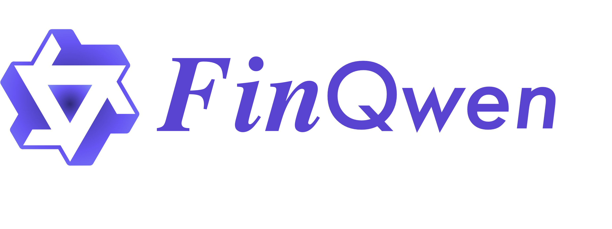
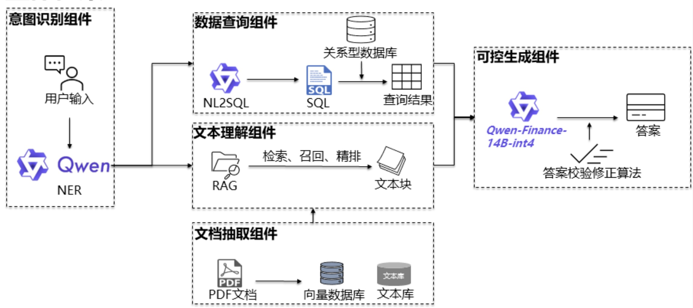
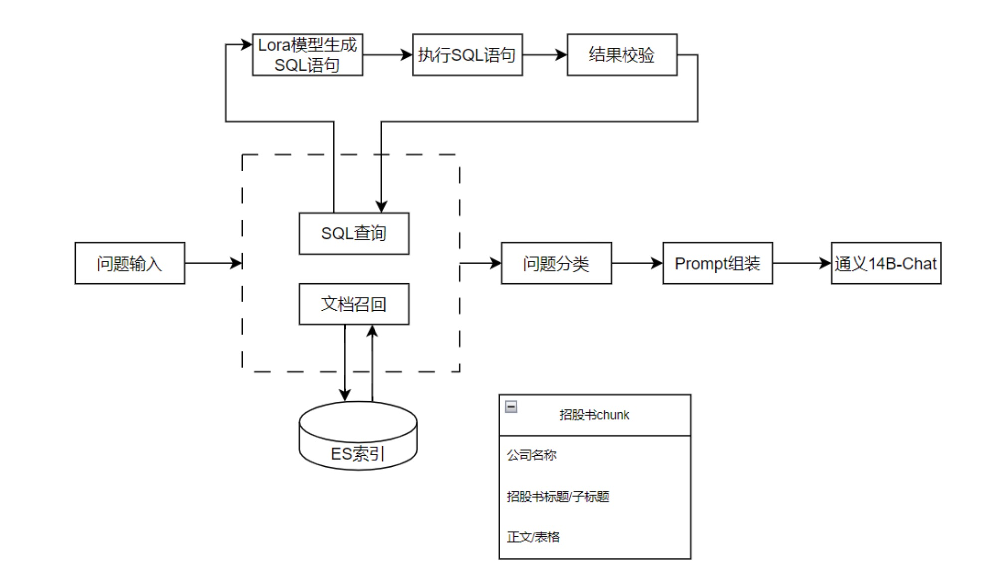
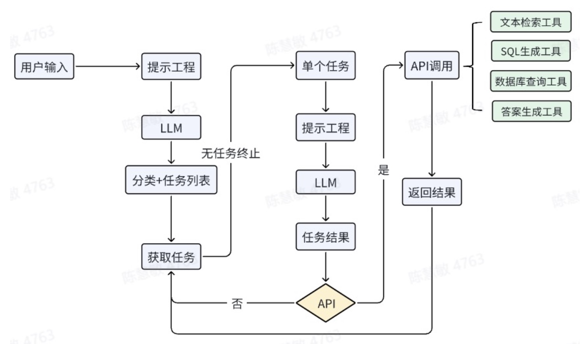
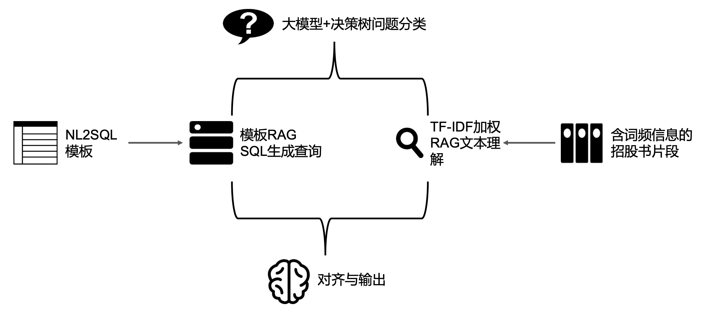
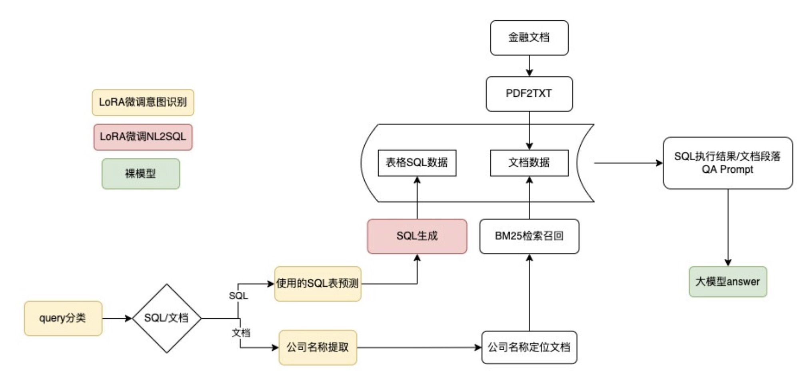
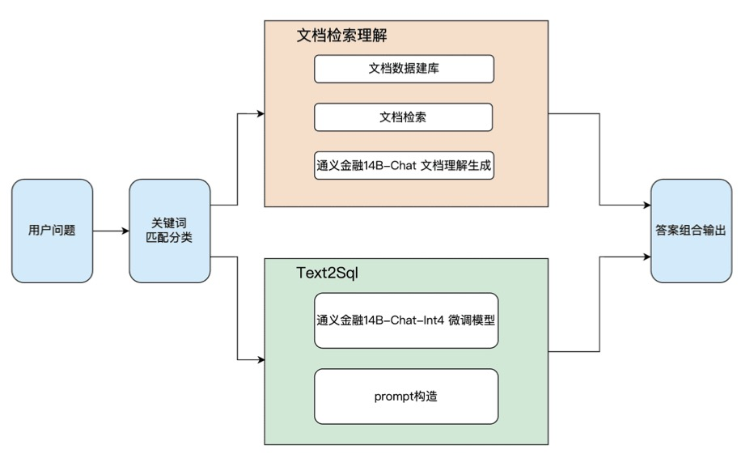

    

  <a href="https://tianchi.aliyun.com/competition/entrance/532164">挑战赛链接</a> |
  <a href="https://tianchi.aliyun.com/competition/entrance/532172">学习赛链接</a> |
  <a href="https://modelscope.cn/organization/TongyiFinance">模型链接</a> |
  <a href="https://www.modelscope.cn/datasets/BJQW14B/bs_challenge_financial_14b_dataset/summary">数据集链接</a>

📃 **FinQwen**:  FinQwen: 致力于构建一个开放、稳定、高质量的金融大模型项目，基于大模型搭建金融场景智能问答系统，利用开源开放来促进「AI+金融」。

【🔥 2023/11/24 Update】开源[通义千问金融大模型](https://modelscope.cn/organization/TongyiFinance)，上下文窗口16K，提供全精度和int4量化版本；

---

## 🚀 目录

- [项目介绍](README.md#项目简介)
- [项目框架](README.md#项目说明)
    - [1. 数据说明](README.md#数据说明)
    - [2. 模型说明](README.md#模型说明)
    - [2. 评测说明](README.md#评测说明)
- [比赛项目](README.md#优秀开源方案)
  - [1. 饺子研究院](README.md#饺子研究院)
  - [2. 果树灌溉技术组](README.md#果树灌溉技术组)
  - [3. hxjj](README.md#hxjj)
  - [4. 大模型说的队](README.md#大模型说的队)
  - [5. 梦想还是要有的](README.md#梦想还是要有的)
  - [6. 猫街四果汤](README.md#猫街四果汤)
- [优秀平台&框架](README.md#优秀平台&框架)
- [贡献者](README.md#贡献者)
- [免责声明](README.md#免责声明)
- [致谢](README.md#致谢)

---

## 📖 项目简介
📈 本项目，源自“[2023博金大模型挑战赛](https://tianchi.aliyun.com/competition/entrance/532164)”，目前天池平台长期开放[学习赛](https://tianchi.aliyun.com/competition/entrance/532172)供大家学习和提交方案。

🚀 随着人工智能和数字化技术在金融领域的日益广泛应用，本项目希望借助社区的力量，共同探索大预言模型在金融科技中的应用潜力。针对金融场景，此次项目和比赛主要聚焦LLM问答系统，希望针对金融场景的结构化数据、文本数据等，实现高质量的检索和问答。

📘 基于此次比赛和项目，分别开源了[通义千问金融大模型](https://modelscope.cn/organization/TongyiFinance)系列模型、[博金大模型挑战赛金融数据集](https://www.modelscope.cn/datasets/BJQW14B/bs_challenge_financial_14b_dataset/summary)和[比赛评测程序](./eval)

---
## 🛠 项目说明

### 1. 数据说明
包括10张基金表数据和80篇招股书文档，更多说明参考<a href="https://www.modelscope.cn/datasets/BJQW14B/bs_challenge_financial_14b_dataset/summary">数据集链接</a>

####  10张表，用sqlite存储。选手可自行替换为其他db。区间为2019年至2021年
- 基金基本信息
- 基金股票持仓明细
- 基金债券持仓明细
- 基金可转债持仓明细
- 基金日行情表
- A股票日行情表
- 港股票日行情表
- A股公司行业划分表
- 基金规模变动表
- 基金份额持有人结构

####  招股说明书
- 80份招股说明书

### 2. 模型说明

“2023博金大模型挑战赛”限制选手只能使用“[通义千问金融大模型](https://modelscope.cn/organization/TongyiFinance)”或“[通义千问7B模型](https://modelscope.cn/organization/qwen)”，在后续学习赛和开源过程中，欢迎各位参与的同学使用其他模型和方案。

关于通义千问金融大模型，我们基于[通义千问14B模型](https://modelscope.cn/models/qwen/Qwen-14B/summary)，主要做了以下更新：

- 扩展金融行业词表；
- 增量训练行业金融200B规模，涵盖中英文财报、研报、新闻、书籍、论坛等多种类型数据；
- 训练上下文扩展到16K，借助NTK和LogN等技术，推理长度可以扩展到64K；

支持modelscope和huggingface官方训练框架，更多技术细节和fine tune脚本，请参考[Qwen主页](https://github.com/QwenLM/Qwen)，以及[Qwen Technique Report](https://arxiv.org/abs/2309.16609)。

### 3. 评测说明

此次项目，同时开源了“2023博金大模型挑战赛”的评测代码，具体详见[eval目录](./eval)，评测主要从两个角度出发：

- 参考答案中的关键信息，如关键词、数据查询结果、文本查询结果，是否包含在选手提供的最终回答中，主要考察recall指标；
- 选手答案的语义信息与参考答案是否接近，综合考察F1 score和基于向量的文本相似度 (具体采用开源模型 [shibing624/text2vec-base-chinese](https://huggingface.co/shibing624/text2vec-base-chinese))

---

## 🏆 优秀开源方案

2023博金挑战赛复赛选手成绩：

| 排名 | 参与者       | 组织           | 分数   | data_query | text_comprehension | 最优成绩提交日 |
|-----|-------------|---------------|-------|------------|-------------------|------------|
| 1   | 饺子研究院   | comm          | 83.27 | 90.46      | 72.48             | 2023-12-12 |
| 2   | 果树灌溉技术组 | QTrade      | 82.02 | 89.72      | 70.48             | 2023-12-12 |
| 3   | hxjj        | 华夏基金       | 81.05 | 91.02      | 66.09             | 2023-12-12 |
| 4   | 大模型说的队 | 北京大学      | 81.03 | 87.46      | 71.39             | 2023-12-10 |
| 5   | 梦想还是要有的 | 杭州某厂   | 76.55 | 82.89      | 67.04             | 2023-12-11 |
| 6   | 猫街四果汤   | 猫街          | 75.72 | 83.37      | 64.24             | 2023-12-12 |
| 7   | 土豆刺客     | 暂无          | 74.56 | 85.46      | 58.22             | 2023-12-10 |
| 8   | 何李双人组   | 广西大学     | 74.40 | 84.80      | 58.79             | 2023-12-12 |
| 9   | 挖矿的小孩   | 上海交通大学 | 74.27 | 78.12      | 68.50             | 2023-12-12 |
| 10  | 3110        | 中国农业科学院 | 71.73 | 81.64      | 56.86             | 2023-12-12 |

### 1. 饺子研究院 

[[PPT]](./solutions/1_饺子研究院/slides.pdf) 

### 2. 果树灌溉技术组

[[PPT]](./solutions/2_果树灌溉技术组/slides.pdf)

### 3. hxjj

[[PPT]](./solutions/3_hxjj/slides.pdf) [[代码]](./solutions/3_hxjj/app)

### 4. 大模型说的队

[[PPT]](./solutions/4_大模型说的队/slides.pdf) [[代码]](./solutions/4_大模型说的队/app)

### 5. 梦想还是要有的

[[PPT]](./solutions/5_梦想还是要有的/slides.pdf) 

### 6. 猫街四果汤

[[代码]](./solutions/6_猫街四果汤/app) 

------

## 🌱优秀平台&框架

在整理该项目的过程中，我们也发现了很多优秀的开源项目和产品：

- [通义点金](https://tongyi.aliyun.com/dianjin)，也算是夹带一些私货，针对金融场景，我们打造了业界首个基于multi-agent框架的金融产品，能够分析事件，绘制表格，查询资讯，研究财报，深度对话等；
- [FinGLM](https://github.com/MetaGLM/FinGLM)，基于GLM模型针对金融财报问答场景构建的对话智能系统；
- [FinGPT](https://github.com/AI4Finance-Foundation/FinGPT)，一个开源的针对金融场景的GPT框架，包括底层数据支持，模型训练，到上层应用。
- ...

## 🤝 贡献者
以下是为本项目做出贡献的团队和个人：

- 🌟 饺子研究员
- 🌟 果树灌溉技术组
- 🌟 hxjj
- 🌟 大模型说的队
- 🌟 梦想还是要有的
- 🌟 猫街四果汤
- 🌟 ... 更多贡献者

FinQwen 开源项目出于完全公益目的，欢迎所有开发者申请加入，以及提交更多优秀代码方案。

## 免责声明

本项目相关资源仅供研究、交流使用，一般不建议用于商业用途；如用于商业用途，由此所带来的法律风险，请自行承担。

涉及到模型商业使用问题，请务必遵循相关模型的协议，例如 [通义金融](https://modelscope.cn/organization/TongyiFinance)。

## 致谢

感谢参与到比赛的每一位选手，是你们的努力造就了此次项目的开源。

感谢FinGLM项目，让我们看到社区的力量和发展，也启发我们发起此次项目，希望更多的小伙伴参与进来。
