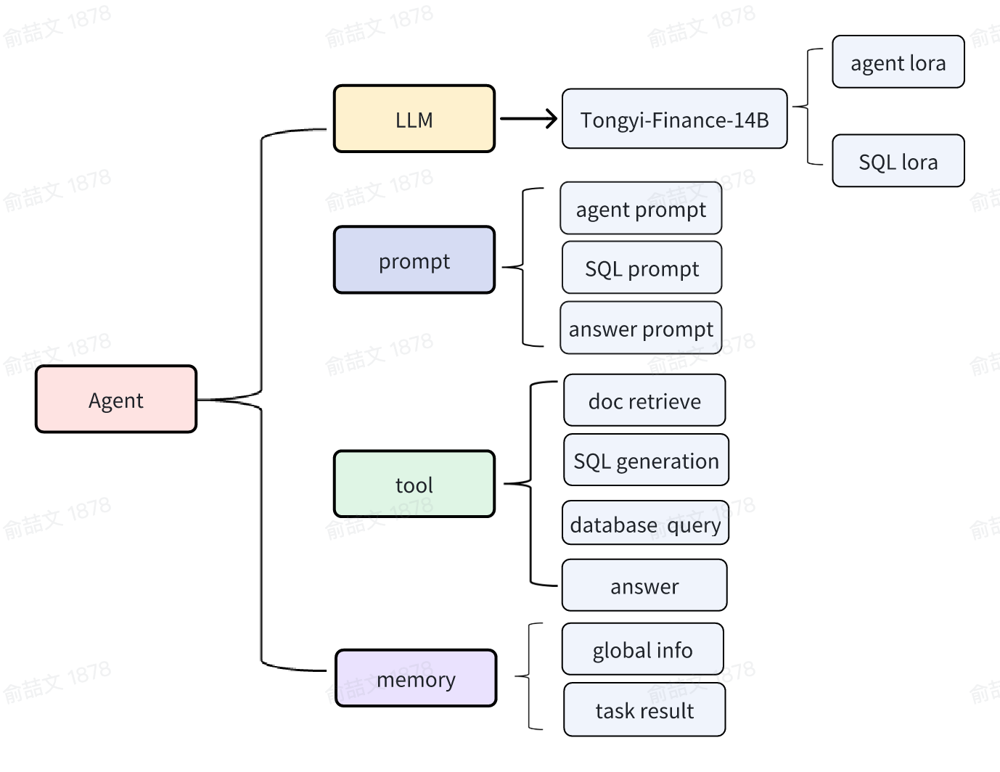

# bs-challenge-financial

## 介绍
博金大模型挑战赛
赛题链接：https://tianchi.aliyun.com/competition/entrance/532164/information


# 简介
## 1. 框架
采用agent的框架，基于modelscope-agent的框架进行改写。



## 2. 流程


## 3. 代码架构

    app
    ｜--agent # agent代码
    ｜--apis # 替代接口形式
    ｜--chains # 工具链也可以认为是较为复杂的工具
    ｜--configs # 配置文件
    ｜--data # 存储目录
    ｜--model # 模型管理
    ｜--models # 模型
    ｜--prompt # 提示词管理
    ｜--retrieve # 检索算法
    ｜--tools # agent工具
    ｜--utils # 常用工具包，包括pdf转txt
    ｜----agent_predict.py # 主程序

## 4. 创新
    1. agent框架的改写，使之能确定特定任务的流程，并准确地调用工具。
    2. agent lora的sft训练，通过构造数据提升泛化能力。
    3. 通过agent构造思维链，提升最后预测的精度
    4. agent异常重试

# 其他
## 准备
1. 数据集下载

    ```shell
    # 要求安装 git lfs
    git clone https://www.modelscope.cn/datasets/BJQW14B/bs_challenge_financial_14b_dataset.git
    ```

    注意：将question.json 和 博金杯比赛数据.db放入data目录下

2.  模型下载

    ```shell
    git clone https://modelscope.cn/models/TongyiFinance/Tongyi-Finance-14B-Chat/summary
    ```

    注意：模型地址和lora模型地址在config/model_config.py 里配置

## 使用
配置好相关参数后，执行run.sh文件或者

```shell
python agent_predict.py \
--question_file_path 'data/question.json' \
--answer_file_path 'data/answer.jsonl' \
--random_seed 1314 \
```


