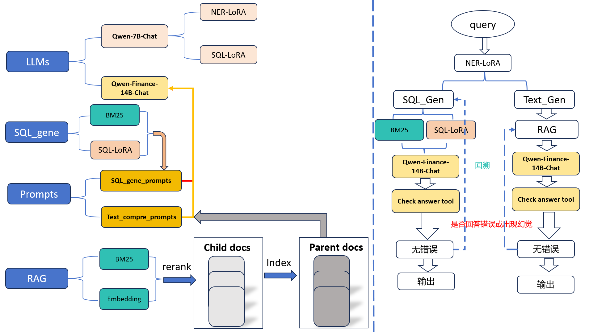

# 博金大模型挑战赛&LLM-agent

## 本方案最终得分：
- 团队名称： **不会ML**

|      类别     |   分数   |
|---------------|----------|
|    总分      |   85.69  |
| data_query    |   92.64  |
| text_comprehension | 75.27  |
## 方案架构

## 代码架构
    app
    | --Config     #参数配置文件夹
    | --data       #数据文件夹
    | --model_api  # 相关模型api启动代码
    | --models     # 本地化部署大模型权重地址
    | --out        # 输出文件夹
    | --Prompts    # 提示工程文件
    | --RAG        # 检索算法
    | --SQL_base   # 数据库管理
    | --train_lora # Lora微调训练代码
    | --utils      # 主要工具：包括PDF2txt,OCR
    | ----requirements.txt # 安装依赖
    | ----run_agent.py # 主程序

## Quick-start

- step1：**首先下载比赛数据集于 app/data/competition_data文件夹内**：

  - /app/data/competition_data/pdf :存放未解析的招股书PDF
  - /app/data/competition_data/pdf2txt：存放解析PDF后的txt文件路径
  - /app/data/competition_data/博金杯比赛数据.db：SQL数据库

- step2:**下载embedding模型，rerank模型**（这里作者选择的embedding模型是bge-large-zh,rerank模型是bge-reranker-large,请预先将模型下载至相应位置

- step3:**安装依赖**
```bash
pip install -r requirements.txt
```

- step4:**解析PDF数据**
```bash
cd app/utils
python pdf_preprocess.py
```
- step5:**启动相关API**：
```bash
cd app/model_api
# 启动embedding模型API
python embedding_api.py
# 启动rerank模型API
python rerank_api.py
# 启动sql模型API
python sql_lora_api.py
# 启动NER模型API
python ner_lora_api.py
```

- step6:**使用Qwen大模型API回答问题**

```bash 
# 不建议使用向量模型进行检索（资源消耗较大）
clear
# 设置运行参数
API_NAME='qwen'
TOP_K=5
PARENT_CHUNK_SIZE=1000
CHUNK_SIZE=200
CHUNK_OVERLAP=50
RERANK_TOP_K=4
# 执行agent运行脚本
python run_agent.py \
    --use_api \
    --api_name $API_NAME \
    --top_k $TOP_K \
    --parent_chunk_size $PARENT_CHUNK_SIZE \
    --chunk_size $CHUNK_SIZE \
    --chunk_overlap $CHUNK_OVERLAP \
    --rerank_top_k $RERANK_TOP_K \
```
- **使用GLM4大模型API回答问题**

```bash 
# 不建议使用向量模型进行检索（资源消耗较大）
clear
# 设置运行参数
API_NAME='glm'
TOP_K=5
PARENT_CHUNK_SIZE=1000
CHUNK_SIZE=200
CHUNK_OVERLAP=50
RERANK_TOP_K=4
# 执行agent运行脚本
python run_agent.py \
    --use_api \
    --api_name $API_NAME \
    --top_k $TOP_K \
    --parent_chunk_size $PARENT_CHUNK_SIZE \
    --chunk_size $CHUNK_SIZE \
    --chunk_overlap $CHUNK_OVERLAP \
    --rerank_top_k $RERANK_TOP_K \
```
- **使用本地部署Qwen-Finance-14B-Chat大模型API回答问题**

```bash     
# 不建议使用向量模型进行检索（资源消耗较大）
clear
# 设置运行参数
API_NAME='glm'
TOP_K=5
PARENT_CHUNK_SIZE=1000
CHUNK_SIZE=200
CHUNK_OVERLAP=50
RERANK_TOP_K=4
# 执行agent运行脚本
python run_agent.py \
    --api_name $API_NAME \
    --top_k $TOP_K \
    --parent_chunk_size $PARENT_CHUNK_SIZE \
    --chunk_size $CHUNK_SIZE \
    --chunk_overlap $CHUNK_OVERLAP \
    --rerank_top_k $RERANK_TOP_K \

```


