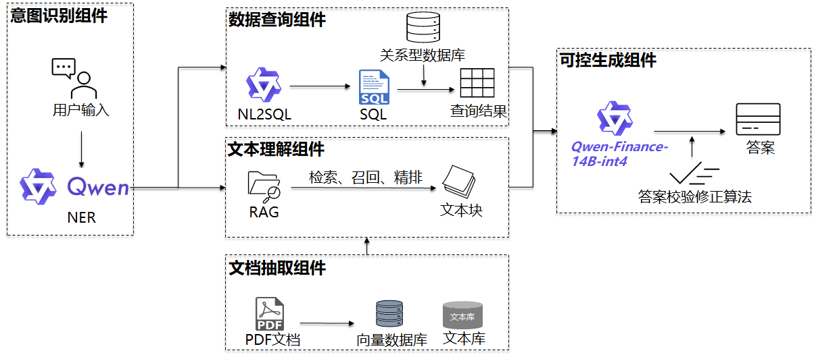

# 1. 方案简介
以“通义千问金融大模型”为核心，通过指令精调显著强化了模型的意图识别和自然语言生成SQL（NL2SQL）的能力，并设计开发了金融文档抽取与清洗算法、基于语义和稀疏的双路检索召回算法、精细化的排序算法、幻觉检查修正算法。通过综合应用这些算法模型，构建了一套精准、泛化、通用、幻觉可控的智能金融问答系统，该系统能够处理金融文本与数据中的专业术语和复杂知识，用AI实现专家级别的查询与分析。

# 2. 技术路线
系统主要四个核心组件：

## 2.1 意图识别组件
经过指令精调的Qwen大模型显著增强了“命名实体识别”（Named Entity Recognition, NER）能力的准确性，能够对用户输入中的关键信息（如公司名称、语义搜索关键词）的精准抽取，并据此判断用户的查询意图。

## 2.2 文档抽取组件
设计了面向金融领域的文档抽取与清洗算法，能有效处理招股说明书、公司财报等复杂结构的长文本PDF，将其抽取清洗为高质量、易检索、内容完整的自然句和Markdown格式表格，并以此构建向量数据库。

## 2.3 文本理解组件
设计了高效、精确的信息检索策略。

首先是语义和稀疏检索的双路检索召回。一方面利用基于Bi-encoder架构的embedding model，实现对海量向量数据库的高效语义检索，并基于章节属性和特殊语义词设计了召回算法，确保召回内容的结构完整性，同时最大化召回率；另一方面，基于改进的BM25算法，进行全文关键词稀疏检索召回。

然后，设计了基于cross_encoder model的精排算法，通过精细化的算法和评估机制减少召回冗余，确保最终命中的文本块与query既相关又准确。

这一策略为大模型提供了高密度有效信息输入，显著降低了幻觉问题，使得生成的答案更加精确和简洁，更少的token数量使得计算开销更小。

## 2.4 数据查询组件
经过指令精调的Qwen大模型具备精准且泛化的NL2SQL能力，针对涉及基金、债券、股票的跨表复杂查询、计算与统计时，能够准确理解多表之间的复杂关联，且对于问题描述方式、计算统计口径、日期、代码、行业、量词等因素显示出高度的泛化能力。

# 3. 亮点
## 3.1 模型层面：
充分利用Qwen的指令跟随能力：提示工程构建高质量、多样化的训练数据集，实现工程初始化；

专业能力强化：指令精调显著增强Qwen的意图识别和NL2SQL能力；

LLM可控生成： 提示工程 + 幻觉检查修正算法。

## 3.2 RAG层面：
文档高质量、易检索、内容完整：面向金融领域的创新性文档抽取与清洗算法；

高效检索和最大化召回率：双路检索召回算法确保关键信息完整；

精排实现高精准率并去冗余：确保命中的文本块与query既相关又准确，减小LLM推理开销，提高准确度。

## 3.3 工程层面：
工程复杂度低：尽可能利用模型自身能力，避免基于规则的方法；

系统高效：多进程实现了LLM生成（计算密集）和多个SQL查询（I/O密集）的异步并行；

支持工具调用：组件根据Modelscope-Agent框架封装，可直接支持Agent工具调用。

